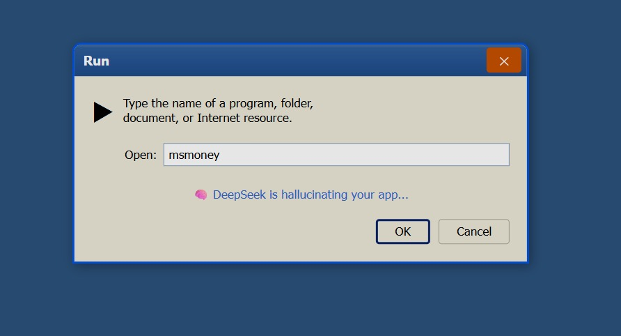
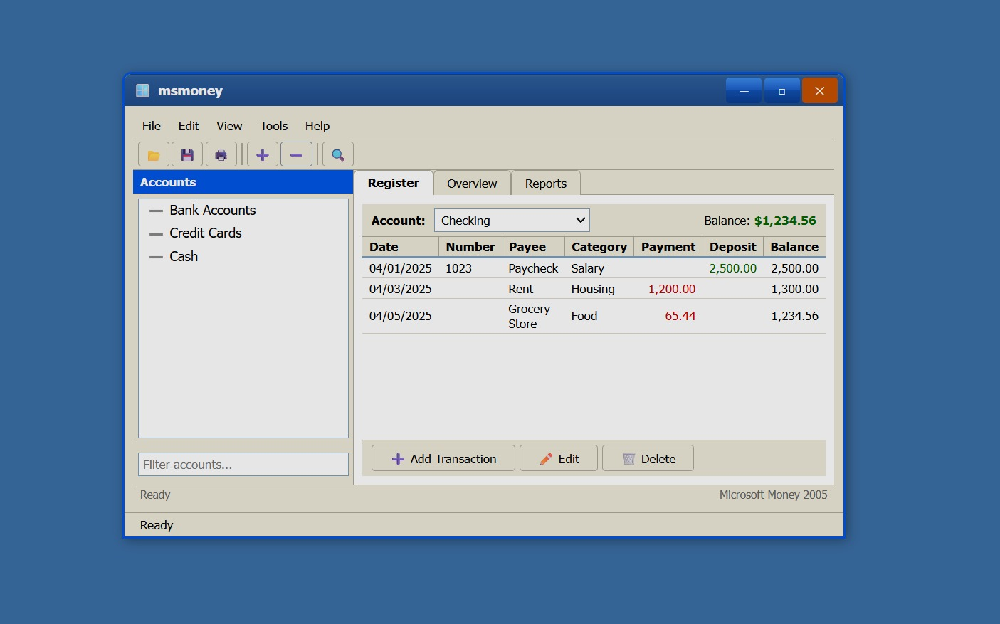

# VibeOS

**AI-hallucinated Windows XP desktop — running entirely in the browser.**

👉 **[Launch VibeOS](https://fivetechsoft.github.io/vibeOS/)**

---

An operating system simulator where every application is generated on-the-fly by DeepSeek AI. Double-click desktop icons, use the Start menu, right-click for context menus — just like a real OS, but apps are hallucinated.

---

## How it works — apps generated live by AI

There is no `msmoney.exe`. There is no code for it anywhere in this repo. You type a name, and the AI **writes the entire app from scratch, in real time**, then runs it.

**1. Ask for any app by name**



Type whatever you want into **Start → Run...** Here we ask for `msmoney` — Microsoft Money, a real personal-finance app Microsoft discontinued in 2009. VibeOS ships **no code** for it. It just hands the name to DeepSeek, which reconstructs the app from memory — *hallucinating* it back into existence, complete and working.

**2. The AI delivers a full app**



Seconds later, a fully-rendered Microsoft Money 2005 clone appears — account tree, transaction register, tabs, toolbar, running balance. None of this was written by a human or stored on disk. The model invented the layout, the data, and the behavior on the spot.

**3. The apps actually work**

These aren't static mockups. DeepSeek ships each app with its own JavaScript, which VibeOS executes in a sandbox scoped to that window — buttons click, inputs update, state lives. A generated stopwatch really counts; a generated to-do list really adds and removes items; a generated calculator really does the math. Each app's script gets three helpers (`root`, `$`, `$all`) so it can wire its own widgets without touching the rest of the desktop.

> **This is a toy today.** Apps are conjured per-run and don't persist across sessions — close the window and it's gone. But within a window they're live, interactive programs, not screenshots. A glimpse of a direction: software conjured on demand from a description, no install, no build, no source. Where this goes in a few years — who knows.

---

### Built-in Apps
- 📝 Notepad &nbsp; 🧮 Calculator &nbsp; 📁 File Explorer &nbsp; ⬛ Command Prompt &nbsp; 🌐 Internet Explorer
- 🎨 Paint (toolbox + color palette) &nbsp; 💣 Minesweeper (playable 9×9 grid)

### Features
- **Start → Run...** — type any app name, DeepSeek generates it live
- **Live apps** — generated apps run real JavaScript, scoped per window (buttons, inputs, state all work)
- **Right-click desktop** — context menu with Style submenu
- **3 themes** — Windows XP · Mac OS · Apple Lisa
- **Window management** — drag, resize, minimize, maximize, close
- **Rubber-band selection** on desktop
- No server needed — pure HTML/CSS/JS, hosted on GitHub Pages

### Files
```
index.html    — XP desktop shell
xp.css        — Luna theme + Mac + Lisa styles
xp.js         — window behaviors (menus, drag, resize, selection)
vibe.js       — app logic, templates, DeepSeek API, per-window script execution
```
